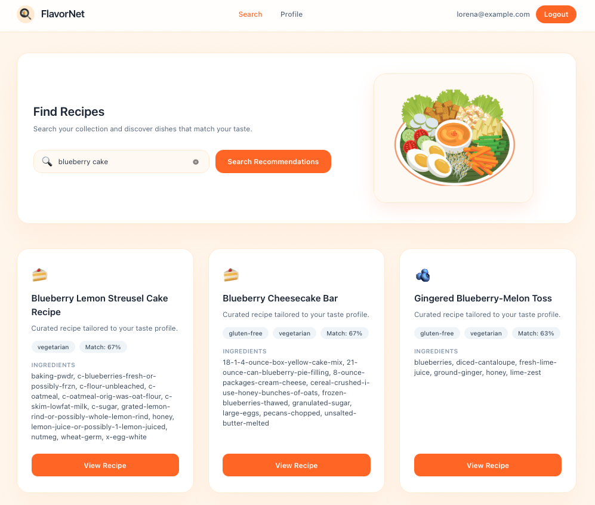
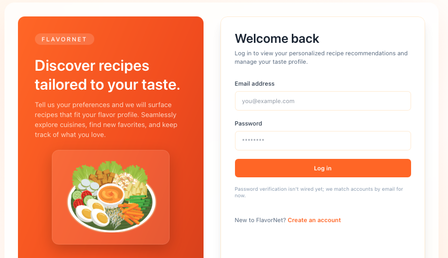
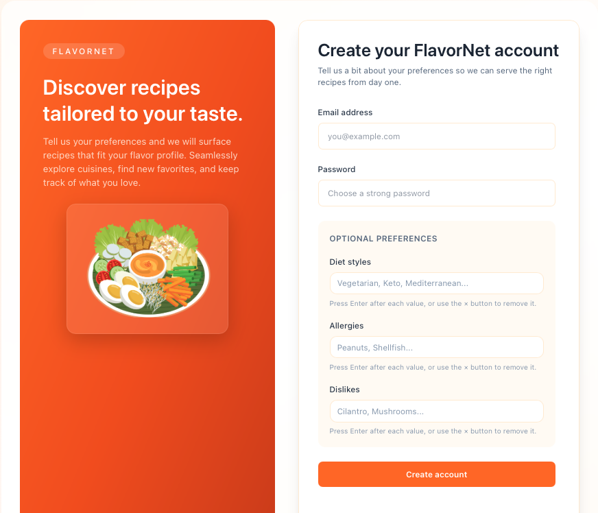
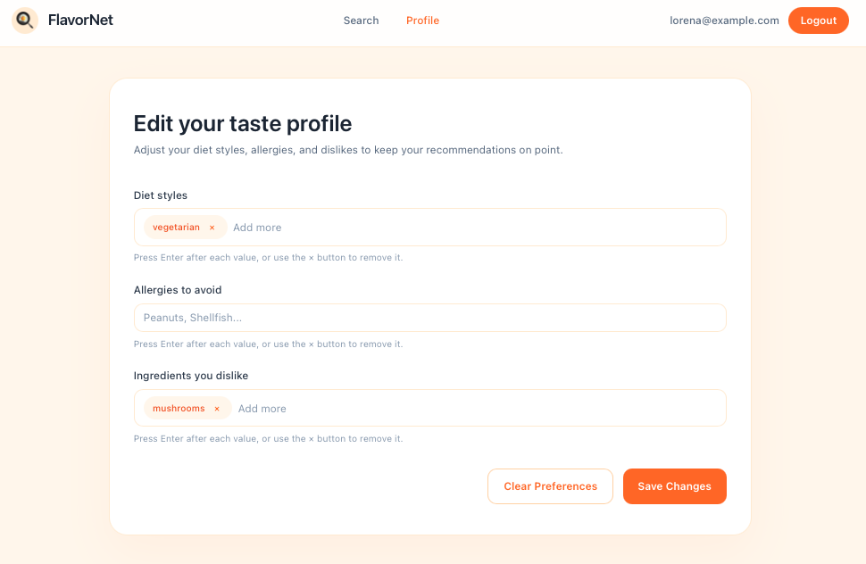
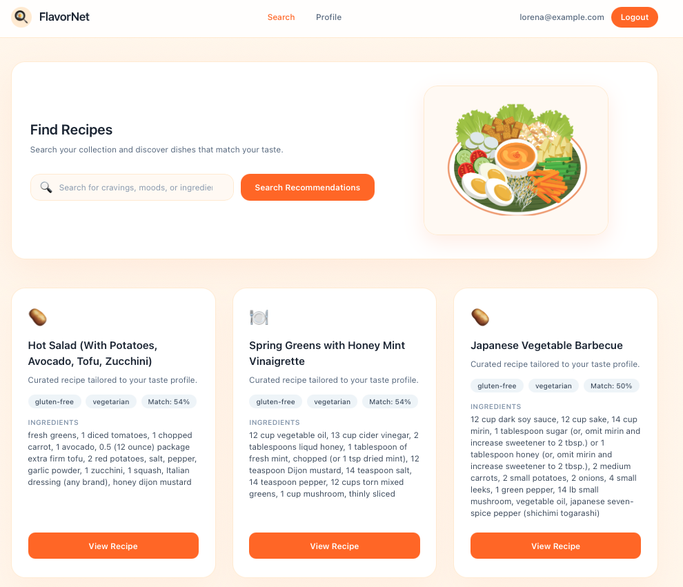

# FlavorNet
by Sejma Sijaric & Lorena Raichle

FlavorNet is a multi-database recipe recommendation app that serves a FastAPI backend and a Vite/React frontend. It combines vector search (Qdrant), document storage (MongoDB) and relational data (PostgreSQL) to deliver personalized, filterable recipe results.

Discover curated recipes tailored to your taste profile. From here you can browse suggestions or refine your search.




---

## Quick Start

```bash
docker compose up --build -d
```
Frontend to use the whole Multi Database System and browse through recipes. 
Frontend: http://localhost:5173  

---

### UI Walkthrough

open  http://localhost:5173  

#### 1. Welcome to Flavornet on  http://localhost:5173  

<details>
  <summary>Show login screenshot</summary>

  
</details>

---

#### 2. Create account

Create a FlavorNet account and (optionally) set your diet styles, allergies, and dislikes during signup or later in the "profile" section.

<details>
  <summary>Show signup screenshot</summary>

  
</details>

---

#### 3. Edit taste profile

Update your diet styles, allergies, and disliked ingredients at any time from the Profile page.

<details>
  <summary>Show taste profile screenshot</summary>

  
</details>


---

#### 4. Get Inspired According to your personalized Preferences, Allergies, Dislike settings

Here you can browse through all recipes of all types, cuisines and ingredients that match your indicated settings.

<details>
  <summary>Show Inspiration Screenshot</summary>

  
</details>

---

#### 5. Search tailored recommendations

Use the search bar to type cravings like “blueberry cake” or “spicy tofu” and get matching recipes according to your defined search + user settings.

<details>
  <summary>Show search screenshot</summary>

  
</details>


To stop:
```bash
docker compose down
```

## Project Layout
- `app/` – FastAPI backend (routes, services, DB clients)
- `frontend/` – Vite/React UI
- `docker-compose.yml` – Orchestrates backend, frontend, MongoDB, PostgreSQL, Qdrant
- `vectorDB/` – Scripts for embedding/generating Qdrant collections
- `sql/`, `mongoDB/` – Example/init data

## Services & Data

### MongoDB (recipes store)
- What: Canonical recipe documents (title, slug, description/summary, ingredients, steps, dietary/allergen tags, flavour/technique tags, rating, source_url, images, nutrition).
- How built: Loaded from preprocessed JSONL (see `mongoDB`/vectorDB pipelines); tags are normalized. Used as the source of truth for payload hydration and filtering.
- Used for: Returning full recipe detail based on predefined user preferences (steps, ingredients, nutrition, images); fallback results when vector search is unavailable.

### Qdrant (vector search)
- What: Vectors (`v_text`, `v_ingredients`, 384-dim cosine) plus payload mirrors of Mongo fields (slug, tags, etc.).
- How built: `vectorDB/data/generate_embeddings.py` encodes recipes, creates/updates the `recipes` collection, and upserts points with payloads.
- Used for: Semantic search and personalized recommendations (vector search + preference filters). Backend hydrates vector hits with Mongo docs and re-filters to enforce diet/allergy/dislikes before returning.

### PostgreSQL
- What: Relational store (users/preferences and related app data).
- How built: Initialized via `sql/init` in docker compose; accessed through SQLAlchemy async.
- Used for: User profiles and saved preferences that drive filtering.

## Running the Stack
1) Ensure Docker + Docker Compose are installed.
2) From repo root: `docker compose up --build -d`
3) Frontend reachable at http://localhost:5173

Useful checks:
```bash
curl -s http://localhost:8000/          # backend health
curl -s http://localhost:6333/healthz   # Qdrant health
docker compose logs backend | head      # backend logs
```
Container logs can also be inspected in the individual containers. 

## Frontend
- Vite/React, Tailwind-esque utility classes.
- Search page: vector-backed search with preference filters applied server-side.
- Recipe detail: shows steps, ingredients, diet tags, nutrition (if available), images (if available), and source link.

## Backend Highlights
- FastAPI app in `app/main.py`; routes in `app/routes/`.
- Recommendation logic in `app/services/recommendations.py`:
  - Loads user prefs (diet/allergies/dislikes) from Postgres.
  - Builds Qdrant filter + embeds query; fetches over-limit hits; hydrates with Mongo docs; hard-filters by prefs (including tag gaps and vegan/allergen text scans); requires steps to be present.
  - Falls back to top Mongo recipes if vector search fails.
- Qdrant client in `app/core/qdrant.py`; Mongo client in `app/core/mongo.py`; embedding model in `app/core/embeddings.py`.


## Commands Reference
```bash
docker compose up --build -d     # start everything
docker compose down              # stop and remove containers
docker compose stop              # just stop containers
docker compose logs backend      # view backend logs
docker exec -it mongo mongosh --quiet appdb --eval 'db.recipes.countDocuments()'
docker exec -it mongo mongosh --quiet appdb --eval 'db.recipes.findOne({slug:"your-slug"}, {_id:0})'
```
